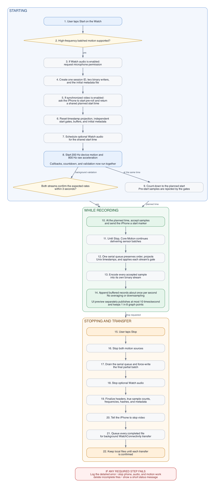

# Recording Flow

This document explains one complete recording without requiring knowledge of
Swift. The app-specific Watch screen and HealthKit workout happen before this
package begins; the workout must already be running when the Watch calls
`startRecording()`.

## Short Version

1. Prepare permissions, local files, and optional iPhone video.
2. Choose one shared start time for motion, audio, and video alignment.
3. Capture both sensor streams at full rate while writing in efficient batches.
4. On Stop, stop the sensors first and finish processing everything already received.
5. Finalize and validate the files, then queue them for background transfer.

## Complete Order

The editable source is [`recording-flow.dot`](recording-flow.dot), with a
[scalable version](recording-flow.svg) also available. Regenerate the displayed
image with `dot -Tpng -Gdpi=180 recording-flow.dot -o recording-flow.png`.

The dotted validation path and the countdown run concurrently. Core Motion is
started early so the package can prove both streams are healthy; samples that
arrive before the planned start are processed but rejected by the start gates.

## What Each Part Owns

| Part | Responsibility |
|---|---|
| Watch app | Starts the HealthKit workout, displays status, and calls start or stop. |
| `WatchRecordingCoordinator` | Owns the overall recording state and enforces the order shown above. |
| Session lifecycle extension | Creates files, coordinates the optional iPhone video, starts audio and motion, and cleans up failures. |
| Motion extension | Receives both sensor streams and processes every batch on one serial queue. |
| iPhone app | Optionally starts video pre-roll, records against the shared session ID, and stops on Watch command. |
| Binary writers | Store every accepted motion sample and finalize counts and hashes. |
| WatchConnectivity transport | Queues completed files and marks each local file as synchronized after transfer succeeds. |

The coordinator reports synchronization while WatchConnectivity has outstanding
recording files. It separately reports how many retained sessions still have at
least one unsynchronized asset. The Watch app publishes both values in its latest
application context so the iPhone can show useful transfer state even when
immediate-message reachability is false.
When a transfer completion callback runs, the completed item can still appear in
WatchConnectivity's outstanding list. The transport excludes that item from the
remaining count so the last completed file clears synchronization state.

## Timing Details That Matter

- Device motion is sampled at 200 Hz. It contains user acceleration, rotation
  rate, gravity, and attitude.
- Raw acceleration is sampled independently at 800 Hz. The two streams are not
  row-aligned; each sample keeps its own timestamp.
- Core Motion may deliver many samples together. Batch delivery does not lower
  the saved sample rate or create stepped data because every sample and its
  original timestamp are encoded.
- The one-second file-write interval only reduces disk operations. It does not
  average, smooth, or discard recorded samples.
- Live numbers are published to SwiftUI at most 10 times per second. When the
  optional Watch graph is visible, it receives one point for every eight
  device-motion samples. This protects Watch responsiveness and battery life;
  it does not change the binary recording.
- When phone coordination is disabled, the package does not request a planned
  start from the iPhone and never applies `scheduledLeadTime` or shows an armed
  countdown. Motion starts as soon as local resources are ready. Disabling Watch
  audio also skips microphone permission and audio preparation.
- With iPhone video enabled, the phone starts recording pre-roll before the
  planned start. The shared timestamp and metadata allow analysis to align the
  useful motion and video interval later.

## Failure Rules

A recording is complete only when both motion streams contain samples and both
binary files can be finalized. If permission, phone preparation, motion startup,
encoding, or writing fails, the coordinator logs the detailed error, stops all
started resources, removes the incomplete files, and does not queue that session
for transfer.

## Small Glossary

- **Hz** means samples per second. 200 Hz is 200 samples each second.
- A **batch** is a group of individual samples delivered or written together.
- A **start gate** rejects samples timestamped before the planned start.
- A **serial queue** processes one piece of work at a time, preserving order.
- A **metadata sidecar** is a small JSON file describing the larger recording files.
- **Finalize** means seal a binary file with its true count, frequency, and hash.

## Code Map

| File | Read it for |
|---|---|
| [`WatchRecordingCoordinator.swift`](../Sources/WatchMotionRecordingKit/WatchRecordingCoordinator.swift) | Public start/stop API, visible state, metadata updates, and transfer commands. |
| [`WatchRecordingCoordinator+Session.swift`](../Sources/WatchMotionRecordingKit/WatchRecordingCoordinator%2BSession.swift) | Steps 3–10 and failure cleanup. |
| [`WatchRecordingCoordinator+Motion.swift`](../Sources/WatchMotionRecordingKit/WatchRecordingCoordinator%2BMotion.swift) | Steps 8–17: sensor callbacks, timestamping, buffering, and draining. |
| [`WatchLiveTelemetry.swift`](../Sources/WatchMotionRecordingKit/WatchLiveTelemetry.swift) | Watch UI throttling and graph decimation. |
| [`WatchAudioCapture.swift`](../Sources/WatchMotionRecordingKit/WatchAudioCapture.swift) | Optional scheduled Watch audio. |
| [`WatchRecordingTransport.swift`](../Sources/WatchMotionRecordingKit/WatchRecordingTransport.swift) | iPhone commands and completed-file transfer. |

When recording order, frequencies, buffering, or failure behavior changes, this
document should be updated in the same change.
